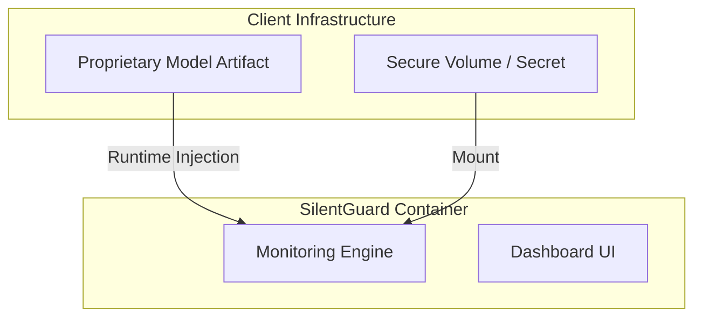

# SilentGuard: Client-Safe Deployment Strategy

**Version:** 1.1.0-Enterprise  
**Focus:** Secure, Non-Intrusive Integration for Black-Box Models

---

## 1. Executive Summary

SilentGuard is engineered as a **Model-Agnostic Monitoring System** designed for high-security environments. A key architectural constraint in enterprise deployments is **Intellectual Property (IP) Protection**: clients often cannot share proprietary model artifacts (`.pkl`, `.joblib`) with the monitoring vendor or embed them into shared container images.

This document details how SilentGuard operates in a **"Zero-Knowledge"** capacity, strictly monitoring input/output behavior and system resources without requiring access to model weights, training data, or internal architecture.

---

## 2. Container Architecture

The system utilizes a decoupling strategy where the **Monitoring Environment** is separated from the **Model Assets**.

### 2.1 The Auto-Generated container
The Docker environment (defined in `Dockerfile`) contains *only* the runtime dependencies (Python, Streamlit, Plotly, Psutil). It **does not** contain the model.



**Security Guarantee:** The Docker image provided by SilentGuard is generic. If the container is inspected or leaked, it contains no proprietary logic.

---

## 3. Secure Model Integration Options

We support three integration patterns depending on client security posture:

### Option A: Runtime Volume Injection (Recommended)
The model file resides strictly on the client's secure host server. It is mapped into the container only at runtime.

*   **Mechanism:** Docker Volume Mount (`-v`)
*   **Command:**
    ```bash
    docker run -v /secure/host/models:/app/models -e MODEL_PATH=/app/models/proprietary_v1.pkl silentguard
    ```
*   **Pros:** Model never leaves client disk. Zero latency.
*   **Cons:** Requires `pickle` compatibility.

### Option B: API / Sidecar Pattern
For models that cannot be loaded by Python (e.g., C++, Java, or compiled binaries), SilentGuard can act as a sidecar, probing the model via localhost HTTP/gRPC.

*   **Mechanism:** `dashboard.py` configured to ping `http://localhost:8080/predict`.
*   **Pros:** Complete technology isolation.
*   **Cons:** Network overhead (minimal on localhost).

### Option C: Mock / Synthetic Mode
For infrastructure testing *before* the model is ready, SilentGuard can run in `Mock Mode` (enabled by default if no model is found). This simulates statistical distributions to verify the monitoring pipeline.

---

## 4. Black-Box Monitoring Methodology

SilentGuard calculates health scores without inspecting the model's internal weights.

| Metric Layer | How it Works (Black-Box) |
| :--- | :--- |
| **1. Latency Profiling** | Measures wall-clock time of the `predict()` call. Independent of model logic. |
| **2. Resource Telemetry** | Uses `psutil` to measure CPU/Memory spikes *correlated* to the inference process ID. |
| **3. Statistical Drift** | Tracks the distribution of *inputs* (Features) and *outputs* (Predictions). If the standard deviation (Z-Score) shifts, we detect drift without knowing *why* the model shifted. |
| **4. Stability Analysis** | **Perturbation Testing:** We inject micro-noise (1%) into inputs and measure output variance. A stable model should not swing wildly. |
| **5. Uncertainty Estimation** | For ensemble models, we track variance across trees. For others, we track temporal variance. |

---

## 5. Production Readiness & Safety

### 5.1 Failure Isolation
The monitoring loop wraps the inference call in a `try/except` block known as the **Safety Harness**.
*   If the model crashes, SilentGuard catches the exception, logs the error, and alerts the operator.
*   The dashboard *remains online* even if the model fails.

### 5.2 Resource Guardrails
SilentGuard itself is lightweight (~50MB RAM). It passively observes "CPU Delta" (the usage *added* by inference) rather than total system load, ensuring we isolate model cost from background system noise.

### 5.3 Data Privacy
*   **No Data Exfiltration:** SilentGuard processes data in-memory.
*   **No External Calls:** The dashboard runs entirely locally (localhost). No telemetry is sent to the cloud.

---

## 6. Client Onboarding Checklist

1.  [ ] **Provision Host:** Ensure Docker is installed on the inference server.
2.  [ ] **Prepare Artifact:** Place `.pkl` or `.joblib` model in a restricted folder (e.g., `/opt/secure/models`).
3.  [ ] **Deploy Container:**
    ```bash
    docker run -d \
      -p 8501:8501 \
      -v /opt/secure/models:/app/models \
      -e MODEL_PATH=/app/models/my_model.pkl \
      --name silentguard_monitor \
      silentguard:latest
    ```
4.  [ ] **Verify:** Access `http://localhost:8501`. Green status indicates successful injection.

---

## 7. Delivery Methods

There are three ways to deliver SilentGuard to the client:

### Method A: Source Package (Simplest)
1.  Receive the `SilentGuard_Release.zip` package.
2.  Unzip on the host server.
3.  Run `docker-compose up --build`.

### Method B: Docker Image Export (Offline / Air-Gapped)
If the client server has no internet access:
1.  We build the image: `docker build -t silentguard:v1 .`
2.  We save it to a file: `docker save -o silentguard_v1.tar silentguard:v1`
3.  Transfer `.tar` file to client.
4.  Client loads it: `docker load -i silentguard_v1.tar`

### Method C: Private Registry (Enterprise)
1.  Pull the image from your private registry:
    ```bash
    docker pull registry.yourcompany.com/silentguard:v1
    ```

---
*Confidential - For Client Distribution Only*
